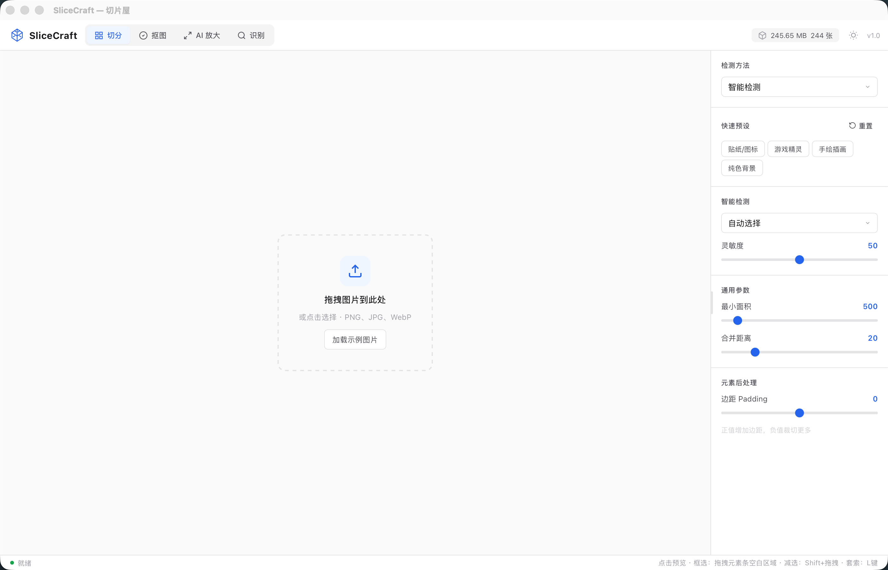
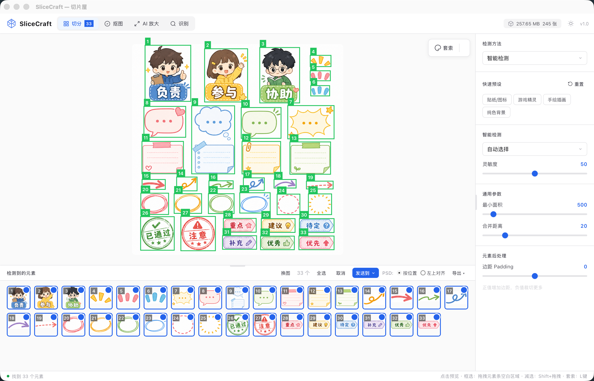
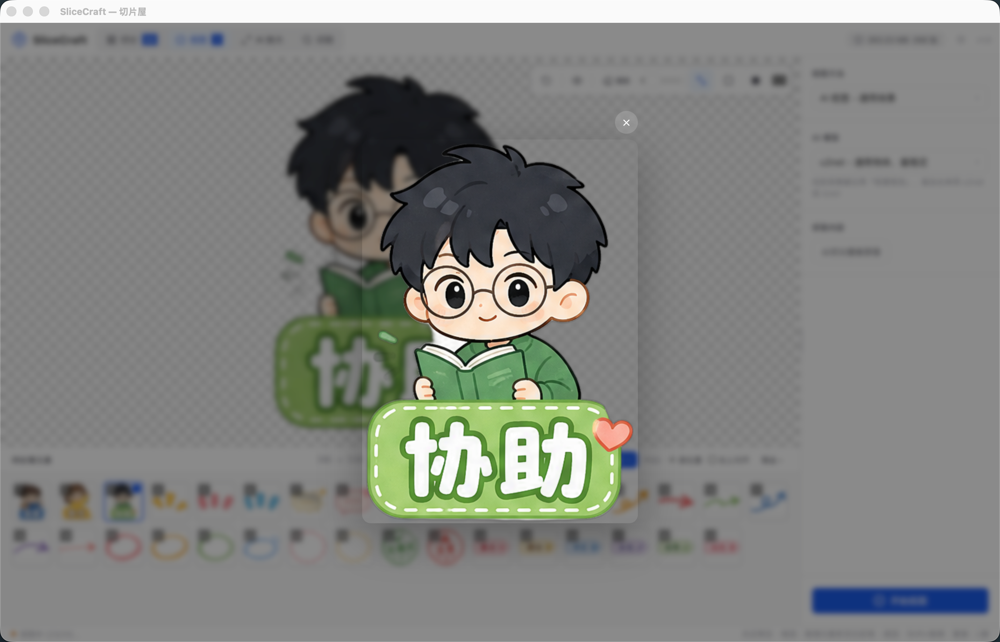
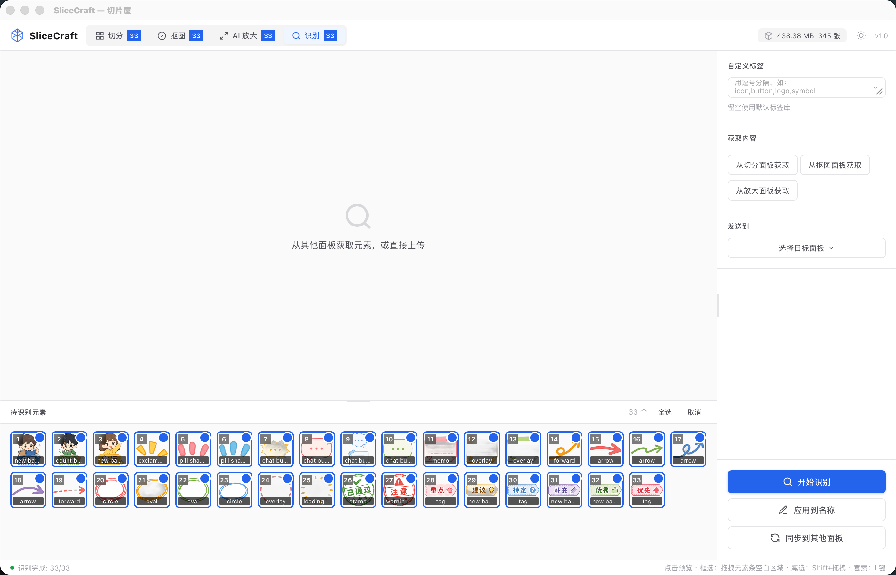
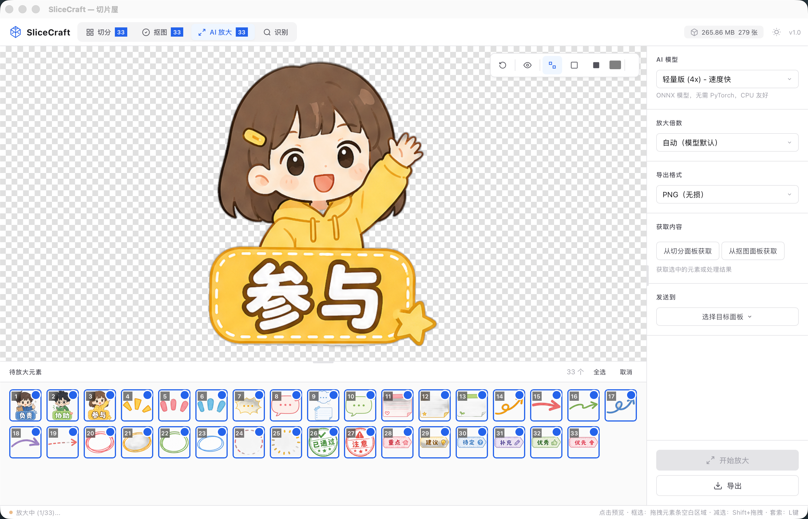

# SliceCraft — 切片屋

> 界面元素提取与识别工具。一张截图，切分 / 抠图 / 识别 / 放大，四步流水线完成素材提取。

将 UI 设计稿或截图拖入，自动检测按钮、图标、卡片、输入框等界面元素，支持批量识别分类、智能抠图、AI 放大，导出为 PNG / ZIP / PSD。

## 界面预览



四个功能面板构成完整流水线：

| 面板 | 功能 |
|------|------|
|  | **切分** — 上传截图，自动检测按钮/图标/卡片/输入框等界面元素，支持智能/边缘/泛洪/Alpha 四种检测模式 |
|  | **抠图** — 一键去除背景 / 泛洪填充 / 吸管取色 / 双重蒙版 |
|  | **识别** — 内置 SigLIP 640 标签零样本分类，支持自定义标签，自动建议文件名 |
|  | **放大** — 基于 Real-ESRGAN 无损放大 2-4 倍，保持边缘清晰 |

## 特性

- **自动检测** — 上传截图即自动识别界面元素，支持二次手动切分
- **AI 抠图** — 一键去除背景 / 泛洪填充 / 吸管取色 / 双重蒙版
- **零样本识别** — 内置 SigLIP 640 标签预分类，也可输入自定义标签
- **AI 放大** — 基于 Real-ESRGAN 的无损放大，保持边缘清晰
- **逐元素编辑** — 每个元素独立命名、排序、拖选，全流程可控
- **暗色主题** — 跟随系统偏好，亦可手动切换
- **多格式导出** — 单张 PNG / ZIP 打包 / PSD（含图层），支持按原始位置或左上对齐
- **跨面板同步** — 元素可在切分 / 抠图 / 放大 / 识别 间任意流转

## 使用流程

```
上传截图 → 切分元素 → 抠图 / 识别 / 放大 → 导出
```
各 Tab 独立流水线，元素可跨面板同步流转。

## 本地开发

```bash
# 启动
./scripts/dev.sh start

# 停止
./scripts/dev.sh stop

# 查看状态
./scripts/dev.sh status
```

访问 http://localhost:3000

## Docker 部署

### 构建镜像

```bash
docker build -t slicecraft:amd64 .
```

### 运行容器

```bash
docker run -d \
  --name slicecraft \
  -p 8001:8001 \
  -v ./backend:/app/backend \
  -v ./frontend:/app/frontend \
  -v ./data:/app/data \
  slicecraft:amd64
```

访问 http://localhost:8001

### NAS 一键部署

```bash
./scripts/deploy.sh "feat: 新功能"
```

部署脚本自动构建 amd64 镜像、推送到 NAS、重启容器。

## SMB 热开发

```bash
# 挂载 NAS 目录到本地
./scripts/mount.sh mount
```

挂载后直接编辑 `/tmp/nas-services/image-splitter/` 下的文件，重启容器生效。

## 技术栈

| 层 | 技术 |
|---|---|
| 前端 | Vanilla JS + CSS（无框架，CSS 变量主题系统） |
| 桌面 | Tauri 2.0（Rust sidecar 启动 Python 后端） |
| 后端 | FastAPI |
| 识别 | ONNX Runtime · SigLIP ViT-B/16（768 维，640 标签） |
| 抠图 | Rembg · OpenCV |
| 放大 | Real-ESRGAN |
| 部署 | Docker · NAS 内网服务 |

## API

| 接口 | 方法 | 说明 |
|---|---|---|
| `/api/upload` | POST | 上传图片 |
| `/api/detect` | POST | 检测 UI 元素 |
| `/api/recognize/clip` | POST | 零样本识别 |
| `/api/remove_background` | POST | 抠图 |
| `/api/export` | GET | 导出 ZIP |
| `/api/export_psd_from_elements` | POST | 导出 PSD |
| `/api/health` | GET | 健康检查 |

## 目录结构

```
.
├── backend/           # FastAPI 后端
│   └── app/
│       ├── recognizers/    # 识别模块（ONNX）
│       ├── upscalers/      # 放大模块 + 模型权重
│       └── ...
├── frontend/          # 前端页面
├── image/             # 界面截图
├── scripts/           # dev.sh / deploy.sh / mount.sh
├── Dockerfile
└── docker-compose.yml
```
